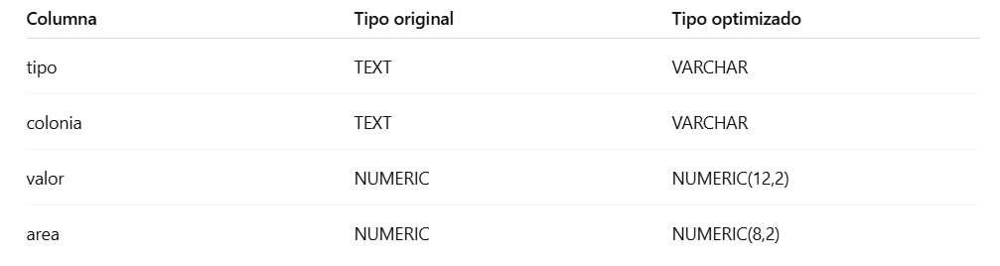

# 📅 Día 6: SQL profesional (Enfoque 100% Práctico)

Este día estuvo enfocado en afianzar de manera práctica los conceptos avanzados de SQL y PostgreSQL estudiados en días anteriores, aplicándolos sobre un dataset real y utilizando buenas prácticas de consulta, optimización y análisis de rendimiento.

El objetivo principal fue pensar como alguien que trabaja con datos en un entorno profesional, no solo escribir consultas que funcionen.

## 🎯 Objetivos del día:

* Consolidar el uso de SQL avanzado mediante casos reales
* Aplicar Window Functions, CTEs y subconsultas correctamente
* Mejorar el modelado de tipos de datos
* Introducir conceptos básicos de optimización con índices
* Analizar el rendimiento de consultas usando EXPLAIN ANALYZE

## 🧱 Preparación del entorno:

* Conexión a PostgreSQL mediante Terminal (psql)
* Uso del schema app
* Trabajo sobre la tabla app.datos
* Verificación de estructura y tipos de datos con:

```sql
\d app.datos;
```

## 🧩 Tipos de datos avanzados:

Se realizó una revisión crítica del tipo de datos de cada columna y se aplicaron mejoras:



```sql
ALTER TABLE app.datos
ALTER COLUMN tipo TYPE VARCHAR;

ALTER TABLE app.datos
ALTER COLUMN colonia TYPE VARCHAR;

ALTER TABLE app.datos
ALTER COLUMN valor TYPE NUMERIC(12,2);

ALTER TABLE app.datos
ALTER COLUMN area TYPE NUMERIC(8,2);
```

## 🧠 Manejo profesional de valores NULL:

Uso de COALESCE para normalizar datos y evitar resultados inconsistentes:

```sql
SELECT
  tipo,
  COALESCE(colonia, 'SIN COLONIA') AS colonia,
  COALESCE(valor, 0) AS valor
FROM app.datos;
```

## 🧪 SQL Profesional Aplicado:

1️⃣ Clasificación de propiedades por rango de precio

```sql
SELECT
  tipo,
  colonia,
  valor,
  CASE
    WHEN valor >= 500000 THEN 'ALTO'
    WHEN valor BETWEEN 200000 AND 499999 THEN 'MEDIO'
    ELSE 'BAJO'
  END AS rango_precio
FROM app.datos;
```
2️⃣ Propiedades por encima del promedio general

Uso combinado de CTE + Window Function:

```sql
WITH base AS (
  SELECT
    *,
    ROUND(AVG(valor) OVER (), 2) AS promedio_general
  FROM app.datos
)
SELECT *
FROM base
WHERE valor > promedio_general;
```
3️⃣ Top 3 propiedades más caras por colonia

Uso de ROW_NUMBER() con PARTITION BY y subconsulta:

```sql
SELECT *
FROM (
  SELECT
    colonia,
    tipo,
    valor,
    ROW_NUMBER() OVER (
      PARTITION BY colonia
      ORDER BY valor DESC
    ) AS ranking
  FROM app.datos
) t
WHERE ranking <= 3;
```
📌 Se utiliza una subconsulta para encapsular la Window Function debido al orden lógico de ejecución de SQL.

## ⚙️ Optimización de consultas:

Creación de índice

```sql
CREATE INDEX idx_datos_colonia ON app.datos(colonia);
```
Este índice permite:

* Evitar Sequential Scan
* Mejorar tiempos de búsqueda, filtrado y ordenamiento
* Optimizar consultas sobre la columna colonia

## ⚙️ Análisis de rendimiento:

```sql
EXPLAIN ANALYZE
SELECT *
FROM app.datos
WHERE colonia = 'Narvarte';
```
Permite analizar:

* Plan de ejecución elegido por PostgreSQL
* Uso (o no) del índice
* Tiempo real de ejecución

## 📝 Notas técnicas clave:

* Las Window Functions deben encapsularse en subconsultas o CTEs si se desean filtrar
* ROW_NUMBER() garantiza una numeración secuencial única por partición
* Los índices impactan directamente el método de acceso a datos
* EXPLAIN ANALYZE es fundamental para validar optimización real
* El orden lógico de SQL influye directamente en cómo se escriben consultas profesionales

## 🛠️ Herramientas utilizadas:

* PostgreSQL
* SQL Shell (psql)
* pgAdmin 4
* GitHub (documentación y evidencia)
* Dataset real de propiedades

## 📂 Evidencia:

* Scripts ejecutados y documentados
* Resultados analizados
* Notas técnicas registradas en Notion
* Código versionado en este repositorio


📌 Este repositorio hace parte de un plan intensivo de 20 días para fortalecer habilidades en PostgreSQL con enfoque en roles profesionales como Data Analyst, DBA Junior o Support Engineer.
